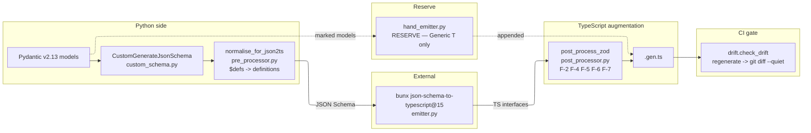

# ARCHITECTURE — pydantic-zod-codegen

> Condensed reference. If you read only one doc in this repo, read this one.

## 1. The problem in one paragraph

The Pydantic-as-single-source-of-truth pattern wants Pydantic v2.13 models on
the Python side to drive **runtime-validated** Zod v4 schemas on the
TypeScript frontend side, with a CI drift gate. No adoptable tool exists:
`pydantic2zod` is stale and emits Zod v3; FastUI emits TS interfaces only;
Zod v4 (Aug 2025) is breaking. This library builds on the empirically
validated FastUI hybrid pattern (CustomGenerateJsonSchema → json2ts) and
extends it with a Zod-v4 emission stage.

## 2. Pipeline



Two-pass hybrid: most models flow through json2ts; models marked
`json_schema_extra={"x-handrolled": True}` are routed to `hand_emitter.py`.
No model is currently marked.

## 3. Component responsibilities

| Component | Role | Notes |
|-----------|------|-------|
| `custom_schema.py` | Pydantic-side override hooks — convention enforcement, discriminator naming, title suppression | Modelled verbatim on FastUI's `CustomGenerateJsonSchema` |
| `pre_processor.py` | 5-line `$defs -> definitions` rewrite | Empirically required for F-1; json2ts URL-encoding bug |
| `emitter.py` | Subprocess wrapper around `bunx json-schema-to-typescript@15` | No global node install — bun handles the cache |
| `post_processor.py` | Zod v4 emission, brand augmentation, JSDoc, tristate, discriminated union | Owns F-2, F-4, F-5, F-6, F-7 |
| `drift.py` | `regenerate -> git diff --quiet` | The CI contract |
| `hand_emitter.py` | RESERVE — Generic[T] escape hatch | Dormant by default, ~150 LoC reference prototype |
| `cli.py` | `pydantic-zod-codegen generate / check-drift / doctor` | argparse, KISS, no click/typer |

## 4. Failure modes (F-1 .. F-7)

The seven failure classes that motivate the pipeline shape. Full table in
[`docs/edge-cases.md`](docs/edge-cases.md). One-line summaries:

- **F-1 recursive** — TreeNode crashes baseline json2ts. Fixed by
  `pre_processor.py` (5-line rewrite).
- **F-2 discriminated union** — emits plain `A | B` loses runtime narrowing.
  Fixed by `custom_schema.py` (naming) + `post_processor.py`
  (`z.discriminatedUnion`).
- **F-3 generic preservation** — `Page[T]` flattens to concrete; generic info
  is lost before json2ts sees it. ESCAPE HATCH only — `hand_emitter.py`.
- **F-4 tristate optional/nullable** — Pydantic conflates three semantics in
  `type: ["string", "null"]`; Zod must distinguish `.optional()` vs
  `.nullable()`. Owned by `post_processor.py`.
- **F-5 annotated metadata** — `Annotated[str, Field(min_length=...)]`
  silently dropped. Owned by `post_processor.py` (brand + JSDoc).
- **F-6 template-literal pattern types** — `Annotated[str, Field(pattern=...)]`
  emits plain `string`. Owned by `post_processor.py`.
- **F-7 datetime/UUID/Decimal** — emits `string` without format check. Owned
  by `post_processor.py`.

## 5. Tristate normalization (F-4 worked example)

Three Pydantic shapes, three Zod chains:

| Pydantic | JSON Schema | Zod |
|----------|-------------|-----|
| `x: str` (required) | `type: string` in `required` | `z.string()` |
| `x: str \| None` (required, nullable) | `type: ["string", "null"]` in `required` | `z.string().nullable()` |
| `x: str \| None = None` (optional, default null) | `type: ["string", "null"]` NOT in `required` | `z.string().nullable().optional()` |
| `x: str = "default"` (optional, default value) | `type: string` NOT in `required`, `default` set | `z.string().default("default")` |

The post-processor needs the **source JSON Schema** alongside the TS output to
distinguish these — the TS output alone collapses them into `string | null`.

## 6. Discriminated union (F-2 worked example)

Pydantic:

```python
class ClickEvent(BaseModel):
    kind: Literal["click"]
    selector: str

class KeyboardEvent(BaseModel):
    kind: Literal["keyboard"]
    key: str

class EventEnvelope(BaseModel):
    event: Union[ClickEvent, KeyboardEvent] = Field(discriminator="kind")
```

Expected emitted Zod (post-processor):

```typescript
const ClickEvent = z.object({ kind: z.literal("click"), selector: z.string() });
const KeyboardEvent = z.object({ kind: z.literal("keyboard"), key: z.string() });

const Event = z.discriminatedUnion("kind", [ClickEvent, KeyboardEvent]);

const EventEnvelope = z.object({ event: Event });
```

Both `Field(discriminator=...)` and `Annotated[..., Discriminator(...)]` forms
must emit the same shape — this is the cross-test idea the property test P-4
guards.

## 7. Drift-test contract

The drift-test contract:

> The committed `.gen.ts` MUST equal what the pipeline emits today. CI runs
> `pydantic-zod-codegen check-drift`. Non-empty diff -> red.

This is **not optional** — the wire protocol is the only thing that ties the
Python server and the Svelte client together, and the Zod schemas are the
runtime contract. Drift = silent breakage at the wire.

The library bakes this in via `drift.py` + the CI `pytest -m drift` marker.

## 8. Hand-emitter activation triggers

Activate `hand_emitter.py` (route specific models to it) ONLY when one of
these triggers holds:

1. **5+ Generic[T] envelope types** — `Page_Item_` / `Result_Foo_` naming
   becomes review-hostile.
2. **Annotated metadata semantically load-bearing on the wire** AND the
   post-processor cannot cleanly preserve it.
3. **Pydantic v3 lands** and breaks `model_json_schema()` enough that
   re-implementing the pipeline costs more than activating the emitter.

None active today (2026-05). Trigger inventory lives in this file — update
when a trigger fires.

## 9. Decisions baked in

| ID | Decision | Source |
|----|----------|--------|
| D-1 | Pydantic pin `>=2.13,<3` | v2.13 SSoT; v3 breaks `model_json_schema()` |
| D-2 | Pipeline = FastUI hybrid (CustomSchema + json2ts@15 + post-proc) | edge-case validation (§4) |
| D-3 | Zod target = v4 (Aug 2025+), v3 emission optional | widest-gap analysis (§10) |
| D-4 | Greenfield build (not fork of `pydantic2zod`) | see §10 |
| D-5 | json2ts invoked via `bunx` (no global node) | fewer runtime deps |
| D-6 | Drift test = `regenerate -> git diff --quiet` | §7 |
| D-7 | Hand-emitter as documented reserve, not primary | §3 / §7 escape valve |
| D-8 | Test pyramid = 5 property tests + 1 drift test, hand-picked | anti-overengineering (§11) |

## 10. Why this is greenfield, not a fork

The build-vs-fork analysis:

> Two viable paths:
> 1. Adopt `pydantic2zod` as Fork-Kandidat: invest in maintaining/extending it
>    for Zod v4 + edge cases. Risk: existing fork inherits an unknown-quality
>    codebase + the maintenance burden.
> 2. Build `pydantic-zod-codegen` greenfield: similar architectural shape to
>    the FastUI hybrid but emitting Zod schemas instead of TS interfaces.
>
> Recommendation lean: path 2 (build greenfield) because (a) we already have
> the FastUI hybrid pipeline conceptually validated, (b) Zod v4's native JSON
> Schema generation opens a clean interop story where Pydantic-JSON-Schema
> and Zod-JSON-Schema can share the same intermediate, and (c) the existing
> `pydantic2zod` is structurally tied to Pydantic-class-walking (not
> JSON-Schema-walking) which doesn't compose with the FastUI pattern.

We're taking path 2.

## 11. Test pyramid (anti-overengineering discipline)

Tests must NOT be more complex than the library they test. Five hand-picked
property tests + one drift gate. NO comprehensive
test-matrix that "covers all Pydantic types" — that path is overengineering.

| ID | Invariant | Why this one |
|----|-----------|--------------|
| P-1 | pre-processor is idempotent | catches subtle re-rewrites of already-rewritten $refs |
| P-2 | pipeline is deterministic | drift-test depends on determinism — hashmaps, tempdirs, timestamps must not leak |
| P-3 | Annotated constraints surface in Zod | F-5 is the silent-drop risk — single highest-value invariant |
| P-4 | discriminator -> `z.discriminatedUnion` | F-2 — wrong emission compiles but breaks runtime narrowing |
| P-5 | tristate maps to distinct Zod modifier chains | F-4 — wrong emission silently changes wire semantics |

If you want to add P-6, justify in `tests/test_round_trip.py` why an existing
property cannot be extended.

## 12. Further reading

- [`docs/edge-cases.md`](docs/edge-cases.md) — the full F-class matrix (F-1..F-7) with component ownership
- [`README.md`](README.md) — quick start + the edge-case showcase
- FastUI's `generate_typescript.py` — production reference for the hybrid pattern (Pydantic team's own codegen)
